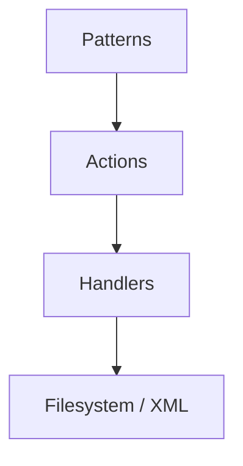
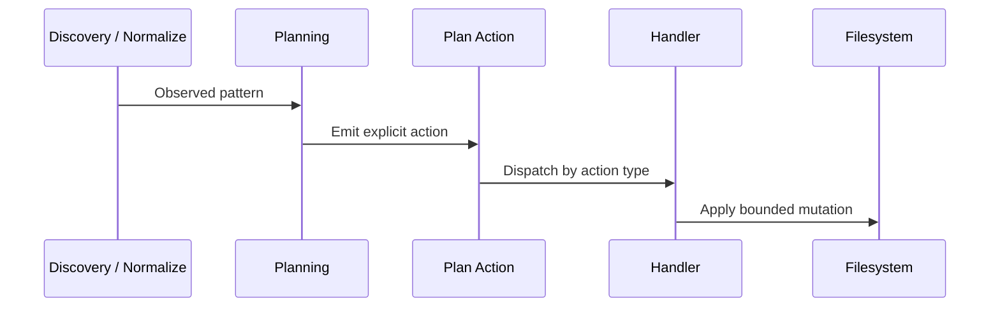

# Patterns, Actions, and Handlers  
## A Model for Scalable DITA Migrations

This document explains how **patterns**, **actions**, and **handlers** work together in the DITA Package Processor, and how to extend them safely when developing real migration jobs.

The goal of this architecture is not elegance.  
The goal is **survivability** under hostile, inconsistent, enterprise-scale DITA packages.

---

## Executive Summary

- **Patterns** capture *what you observe* during discovery and normalization
- **Actions** declare *what should happen* as a result of those observations
- **Handlers** define *how an action is executed* during the execution phase

Each layer has one job.  
Each boundary is enforced.

That separation is what keeps the system debuggable after the 200th exception case.

---

## The Three-Layer Model



Read top to bottom:

> “When I observe *this structural condition*, I declare *these actions*, which are carried out by *these handlers*.”

No layer gets to do the next layer’s job.

---

## 1. Patterns: Capturing What You Learn

### What Is a Pattern?

A **pattern** is an observed, repeatable structural condition in the source package.

Examples:

- An `index.ditamap` exists and delegates to a real root map  
- Abstract content is isolated in a separate map  
- Maps contain unwrapped `topicref` collections  
- Glossary content exists structurally but not semantically  

Patterns are **not executable**.  
They are **not instructions**.

They are recorded facts about the package.

### Where Patterns Live

In the current system, patterns are:

- Detected during **discovery** and **normalization**
- Recorded as evidence, relationships, or invariants
- Referenced indirectly during **planning**

Patterns never mutate content.  
They never imply intent.

### Properties of a Good Pattern

A useful migration pattern is:

- Observational, not prescriptive  
- Stable across packages  
- Expressible as a condition, not a workaround  

Patterns answer one question only:

> *What situation am I in?*

They deliberately avoid answering:

> *What should I do about it?*

---

## 2. Actions: Declaring Intent

### What Is an Action?

An **action** is a declarative instruction emitted during **planning**.

It describes *what must happen*, not *how to do it*.

Actions are serialized into `plan.json` and form a strict contract between planning and execution.

Examples:

- `copy_map`
- `copy_topic`
- `copy_media`
- `inject_topicref`
- `wrap_map`
- `delete_file`

An action looks like this conceptually:

```json
{
  "id": "copy-main-map",
  "type": "copy_map",
  "target": "OutputDoc.ditamap",
  "parameters": {
    "source_path": "Main.ditamap",
    "target_path": "OutputDoc.ditamap"
  },
  "reason": "Resolved index map indirection"
}
```

### Actions as a Contract

Actions are the **only thing execution is allowed to trust**.

Planning says:

> “This is what should happen, and here is why.”

Execution responds:

> “I know how to do exactly that. Nothing more.”

Actions must never be:

- Implicit  
- Inferred at execution time  
- Recomputed from filesystem state  

If it matters, it belongs in the plan.

---

## 3. Handlers: Performing the Work

### What Is a Handler?

A **handler** is a concrete execution unit for a single action type.

Handlers:

- Receive a validated action  
- Resolve paths via `source_root` and sandbox rules  
- Enforce mutation policy  
- Apply exactly one mutation  
- Are idempotent where possible  
- Fail loudly when invariants are violated  

Handlers answer one question only:

> *How is this specific action carried out?*

They do **not** decide whether the action should exist.  
They do **not** inspect package structure.  
They do **not** invent behavior.

That work already happened.

---

## End-to-End Flow

This is the lifecycle of a migration decision:



This separation is the reason the pipeline scales without collapsing into folklore.

---

## Developing for a Migration Job

Migration work is never done once.  
This model assumes you will discover new cases mid-stream.

That’s normal.

---

### Step 1: Encounter a New Case

Example:

> “Some packages contain glossary topics that should become `glossentry` topics.”

Do **not** start in execution code.

---

### Step 2: Name the Pattern

Write the observation clearly:

> “Topics under the ‘Glossary’ node in the definition map represent glossary entries.”

This prevents scope creep later.

---

### Step 3: Decide the Intent

Ask:

> *What should happen when this pattern exists?*

Answer:

- “Refactor glossary topics into `glossentry` topics.”

That intent becomes an **action**.

---

### Step 4: Introduce or Reuse an Action

Options:

- Reuse an existing action if semantics match  
- Introduce a new semantic action if intent is distinct  

Examples:

- `extract_glossary`
- `inject_glossary`
- `refactor_glossary_entries`

Prefer clarity over reuse.

---

### Step 5: Implement the Handler

The handler must:

- Do exactly what the action name promises  
- Validate inputs defensively  
- Respect sandbox and mutation policy  
- Never branch on “package shape”  

No discovery logic.  
No guessing.  
No shortcuts.

---

### Step 6: Lock It with Tests

Extend integration tests to assert:

- Files exist where expected  
- Maps contain expected topicrefs  
- Topics were transformed correctly  
- Reruns are idempotent  

The test suite becomes the living record of your migration logic.

---

## Why This Separation Matters

Without separation, migration systems devolve into:

- Hidden heuristics  
- Untraceable side effects  
- “It worked last time” logic  

With separation:

- Every change is explainable  
- Every mutation is traceable  
- Every failure is local and debuggable  

You can answer:

- “Why was this file copied?”  
- “Why was this topicref injected?”  
- “Why didn’t this glossary convert?”  

Those answers matter when auditors, clients, or future-you ask.

---

## Design Principles Recap

### Patterns
- Observational  
- Stable  
- Describe conditions  

### Actions
- Declarative  
- Explicit  
- Ordered  
- Serialized  

### Handlers
- Deterministic  
- Single responsibility  
- Policy-enforced  
- Boring on purpose  

---

## Final Guidance for Future Migrations

When the migration gets weird, which it will:

1. Name the pattern  
2. Declare the intent as an action  
3. Implement the smallest correct handler  
4. Prove it with tests  
5. Move on  

If you ever feel tempted to “just handle it in the handler,” stop.

That’s how careful systems turn into ghost stories.

This architecture isn’t academic.  
It’s a record of everything you already learned the hard way.