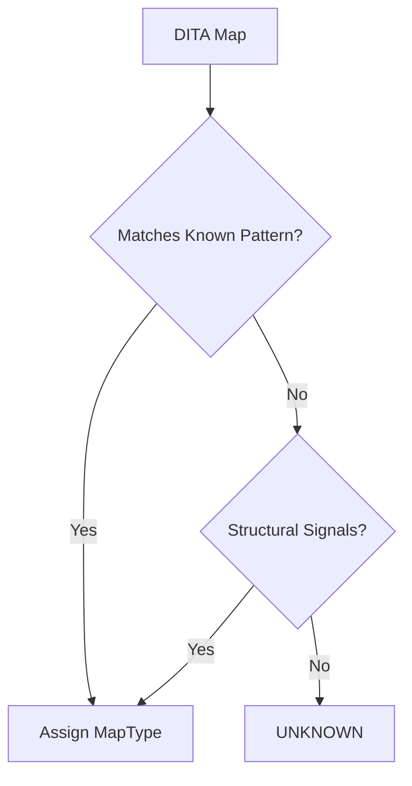
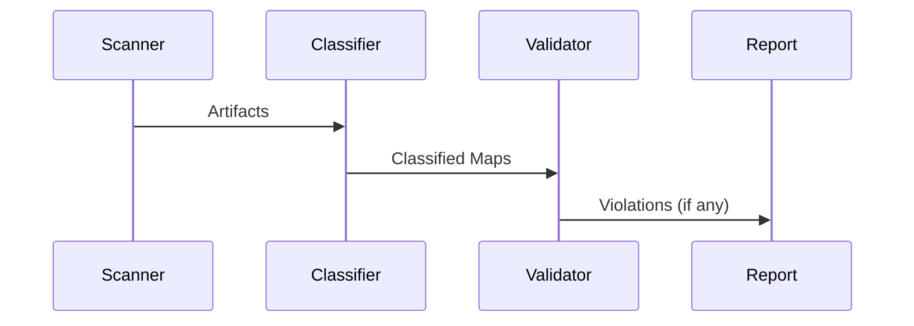

# Discovery Phase

The **Discovery phase** is a *non-destructive, read-only* analysis pass over a DITA package.

Its sole purpose is to **observe, classify, and report** what exists in the package *before* any transformation occurs.

Discovery does **not**:
- modify files
- rename artifacts
- infer intent heuristically
- “fix” malformed content

Discovery exists to prevent the processor from lying to itself.

---

## Why Discovery Exists

Bulk-generated DITA packages are not uniform. They vary across:

- authoring systems
- export pipelines
- organizational conventions
- historical drift
- partial migrations

Earlier versions of the processor implicitly assumed:
- a single main map
- predictable map roles
- consistent filename conventions

Those assumptions held for tests, not reality.

Discovery formalizes the gap between **what we expect** and **what we observe**.

---

## Discovery Responsibilities

Discovery performs the following responsibilities in strict order:

1. **Scan the filesystem**
2. **Parse XML safely**
3. **Identify artifacts**
4. **Classify artifacts**
5. **Validate invariants**
6. **Produce a report**

Each responsibility is isolated and auditable.

---

## Artifact Types

Discovery recognizes two primary artifact categories:

| Category | Description |
|--------|-------------|
| Map | `.ditamap` files |
| Topic | `.dita` topic files |

Classification is **descriptive**, not normative.

---

## Map Classification

Each discovered map is assigned exactly one `MapType`.

Defined in:  
`dita_package_processor.knowledge.map_types`

### Supported Map Types

| MapType | Meaning |
|------|--------|
| MAIN | Primary entry-point map |
| ABSTRACT | Overview / abstract content |
| CONTENT | Regular content map |
| GLOSSARY | Definition or glossary map |
| CONTAINER | Structural wrapper map |
| UNKNOWN | Unclassifiable |

Classification is determined by:
- structural signatures
- referenced content
- known patterns
- filename signals (last resort)

---

### Map Classification Flow



**Important:**  
UNKNOWN is a *valid* classification. It is not an error.

---

## Topic Classification

Topics are classified separately from maps.

### Supported Topic Types

| TopicType | Meaning |
|---------|--------|
| CONTENT | Concept, task, reference |
| GLOSSARY | `<glossentry>` |
| UNKNOWN | Unclear or malformed |

Topic classification is currently shallow and intentionally conservative.

---

## Structural Signatures

Discovery relies on **signatures**, not guesses.

Signatures are structural markers such as:
- root element names
- presence of `<glossentry>`
- mapref-only maps
- empty wrapper maps

Signatures are defined in:

```
dita_package_processor/discovery/signatures.py
```

Signatures may evolve, but they are always:
- explicit
- testable
- documented

---

## Known Patterns

Discovery also consults **known patterns** expressed in YAML.

Defined in:

```
dita_package_processor/knowledge/known_patterns.yaml
```

Patterns encode:
- historical structures
- vendor-specific exports
- known glossary layouts
- migration artifacts

Patterns are **data**, not code.

This allows:
- incremental expansion
- corpus-specific tuning
- safe experimentation

---

## Invariants

After classification, Discovery validates **invariants**.

Invariants are structural truths that must hold for transformation to proceed.

Examples:
- Exactly one MAIN map
- At most one ABSTRACT map
- At most one GLOSSARY map

Defined in:

```
dita_package_processor/knowledge/invariants.py
```

Violation of invariants:
- does **not** crash Discovery
- does **block transformation**
- produces explicit diagnostics

---

### Invariant Validation Flow



---

## Discovery Report

Discovery produces a **structured report** capturing:

- discovered maps and topics
- assigned classifications
- violated invariants
- unresolved ambiguities

Reports are designed to be:
- human-readable
- machine-readable
- diffable
- archived

Defined in:

```
dita_package_processor/discovery/report.py
```

Discovery reports are **artifacts**, not logs.

---

## What Discovery Does *Not* Do

Discovery explicitly avoids:

- guessing user intent
- renaming files
- mutating XML
- repairing broken content
- deciding transformation order

Discovery answers one question only:

> *“What is actually here?”*

---

## Relationship to the Transformation Pipeline

Discovery runs **before** any pipeline steps.

Transformation steps must:
- consume Discovery output
- obey classifications
- respect invariant failures

No step is allowed to “reinterpret” Discovery findings.

---

## Failure Modes (By Design)

Discovery may report:
- UNKNOWN maps
- ambiguous classifications
- invariant violations

This is not failure.

Failure is transforming content without understanding it.

---

## Summary

Discovery turns a DITA package from an opaque blob into a **described system**.

It:
- narrows uncertainty
- surfaces assumptions
- creates defensible boundaries

Everything that follows is only as reliable as Discovery.

If Discovery is wrong, the processor must stop.

That is not caution.  
That is integrity.