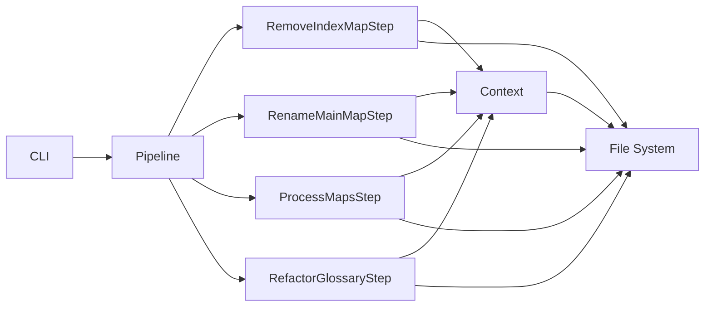
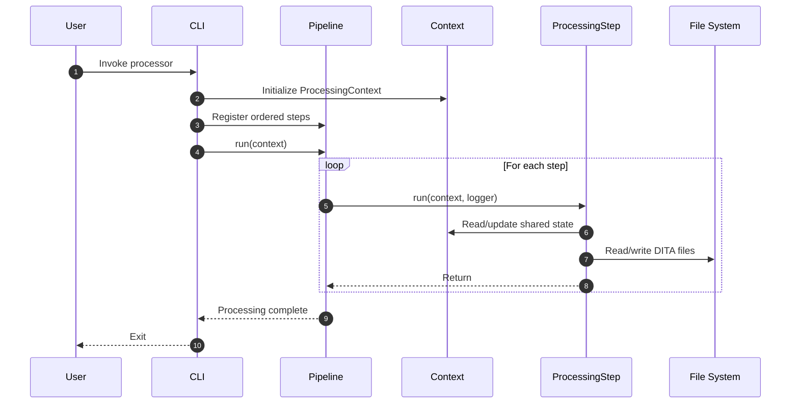
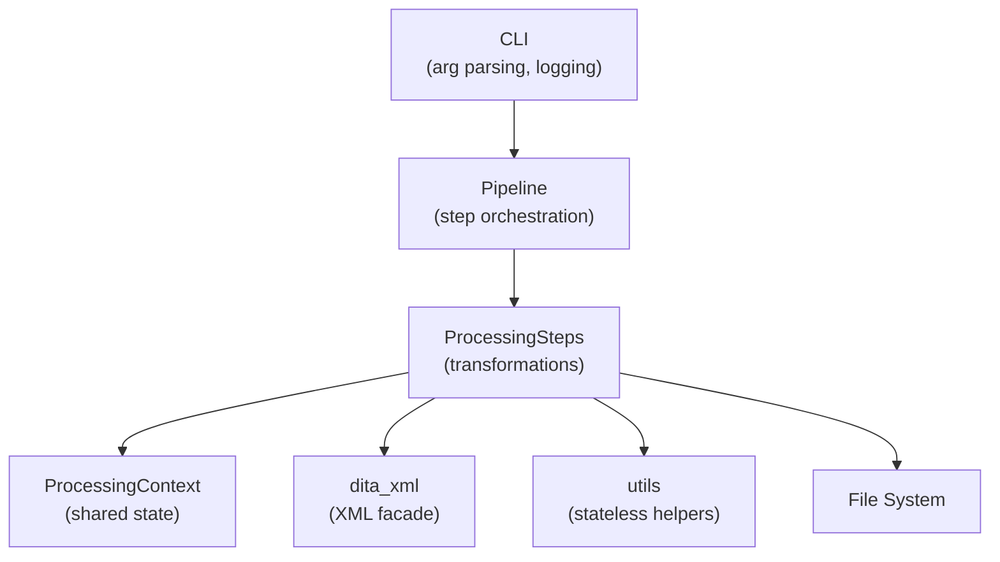
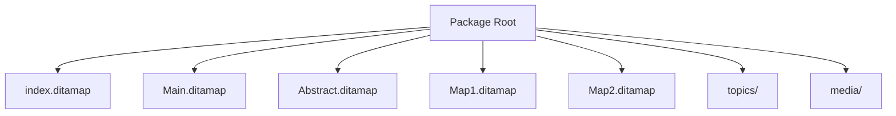
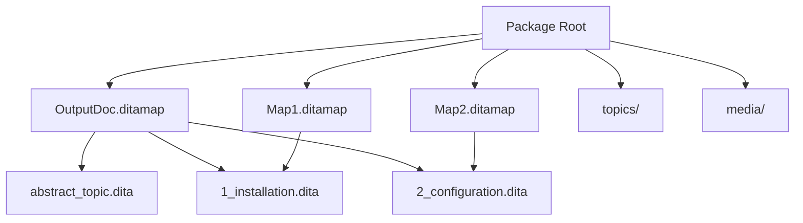
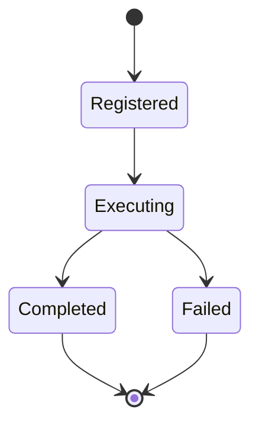
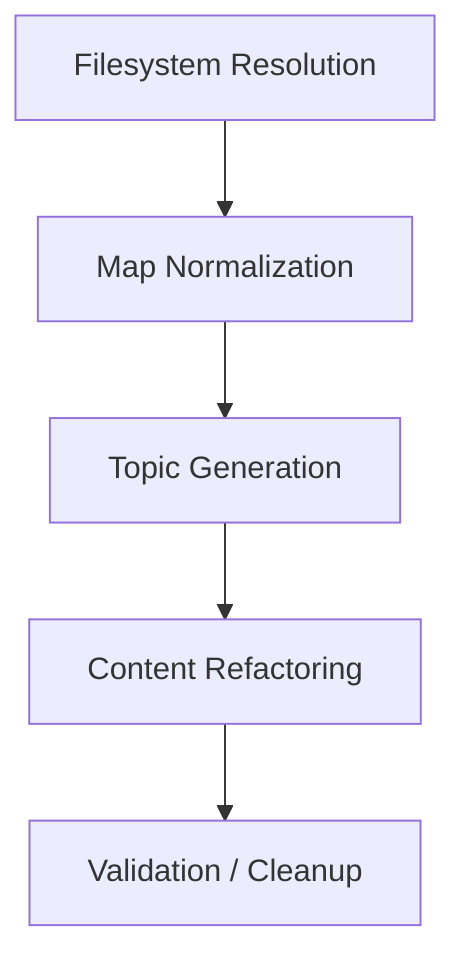
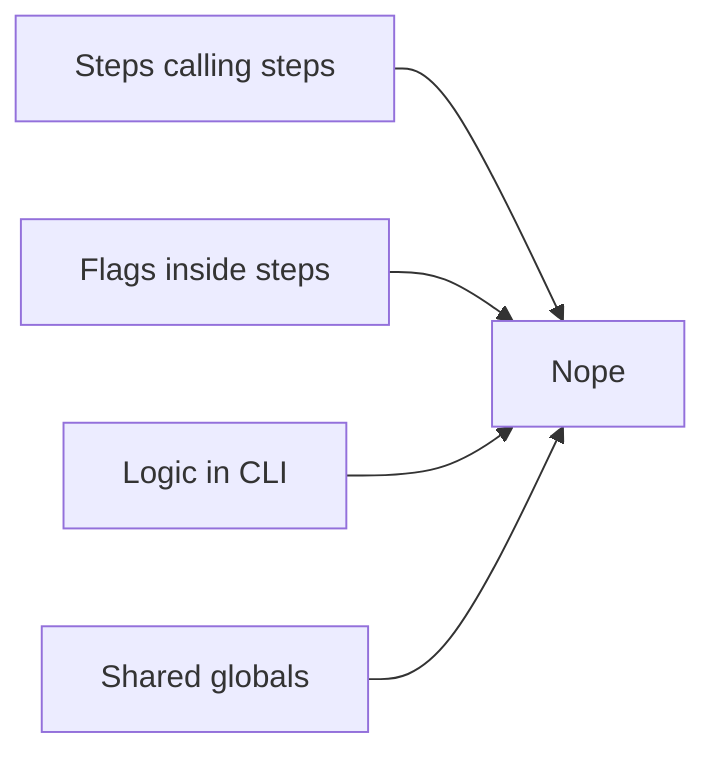

# Extension Guide: DITA Package Processor

## Architecture, Execution Model, and Extension Contract

This document describes the internal architecture of the **DITA Package Processor**, its runtime execution model, and the *only supported mechanism* for extending it with additional processing logic.

The system is intentionally designed as a **deterministic batch pipeline**.  
It favors explicit structure, predictable execution order, and controlled extensibility over flexibility-through-cleverness.

If an extension does not fit this model, it should not be implemented.

---

## System Architecture Overview

At a high level, the processor consists of:

- A CLI entry point
- A pipeline orchestrator
- A shared processing context
- A set of independent processing steps
- Supporting XML and utility modules

Diagram illustrating system architecture:


The architecture enforces strict separation between:

- **Orchestration**: Pipeline  
- **State**: ProcessingContext  
- **Behavior**: ProcessingStep implementations  

---

## Execution Sequence

The following sequence diagram illustrates runtime behavior from invocation to completion.
Diagrams illustrating execution sequence:


### Execution Guarantees

- Steps execute **strictly in order**
- Each step executes **exactly once**
- Steps cannot invoke or skip other steps
- Failures propagate immediately
- There is no retry, branching, or concurrency

This is a linear batch system, by design.

---

## Operational Overview

### Step Preconditions and Postconditions

Each step operates under an explicit contract.

A step may assume its preconditions are met and must guarantee its postconditions upon successful completion.

| Step | Preconditions | Postconditions |
|----|---------------|----------------|
| RemoveIndexMapStep | `index.ditamap` exists and references a `.ditamap` | Main map resolved; `index.ditamap` deleted |
| RenameMainMapStep | Main map path resolved | Main map renamed to `<docx_stem>.ditamap` |
| ProcessMapsStep | Renamed main map exists | Abstract topic injected; maps numbered; wrapper topics created; map topicrefs normalized |
| RefactorGlossaryStep | Definition map configured and exists | Definition child topics transformed to `glossentry` |

### Failure Semantics

- Structural violations fail fast
- Content inconsistencies log warnings and continue
- Partial output is not rolled back
- Subsequent steps do not execute after a fatal failure

This behavior is intentional and supports reproducible batch execution.

---

## Layered Responsibilities
Diagram illustrating system layers:


| Layer | Responsibility |
|------|---------------|
| CLI | Entry point, argument parsing, logging setup |
| Pipeline | Execution order and lifecycle |
| ProcessingContext | Shared, mutable state |
| ProcessingStep | One discrete transformation |
| dita_xml | Safe XML parsing and rewriting |
| utils | Pure helper functions |

---

## Package Structure: Before and After Processing

### Before Processing
Diagram illustrating package structure before processing:


Characteristics:

- `index.ditamap` introduces indirection
- Maps exist as peers with no enforced hierarchy
- Abstract content is isolated
- Navigation structure is implicit

---

### After Processing
Diagram illustrating package structure after processing:


Results:

- `index.ditamap` removed
- Main map renamed deterministically
- Abstract content merged
- Maps normalized under explicit wrapper topics
- Navigation hierarchy becomes explicit and stable

---

## Formal Extension Contract

This section defines the *only supported extension mechanism*.

Anything outside this model is explicitly unsupported.

---

## Extension Model

Extensions are implemented as **new ProcessingStep classes** added to the pipeline.

Each step must:

- Have a single responsibility
- Be independent of future steps
- Use `ProcessingContext` for shared state
- Restrict side effects to the package directory

Steps are not plugins. They are first-class pipeline components.

---

## ProcessingContext Contract

`ProcessingContext` is the sole shared state carrier.

### Stable Attributes

| Attribute | Type | Description |
|--------|------|-------------|
| `package_dir` | `Path` | Root directory of the DITA package |
| `docx_stem` | `str` | Output document filename stem |
| `topics_dir` | `Path` | Derived topics directory |
| `media_dir` | `Path` | Derived media directory |

---

### Derived Attributes

| Attribute | Set By | Description |
|---------|-------|-------------|
| `main_map_path` | RemoveIndexMapStep | Main map resolved from index |
| `renamed_main_map_path` | RenameMainMapStep | Renamed main map path |

Steps may only read derived attributes **after** the responsible step has executed.

---

### Extension Attributes

Extension steps may introduce new context attributes under these rules:

1. Names must be explicit and descriptive  
2. Attributes must be documented in the step docstring  
3. Existing attributes must not be repurposed  
4. Attributes must be optional unless enforced by a prior step  

Example:

```python
context.regex_cleanup_applied = True
```

Context is shared state, not a key-value dumping ground.

---

## Extension Lifecycle
Diagram illustrating step lifecycle:


There is no retry, rollback, or recovery phase.

---

## Step Placement Guidelines
Diagrams illustrating recommended extension placements:


---

## Explicit Anti-Patterns
Diagrams illustrating unsupported extension patterns:

 
Avoid:

- Conditional logic inside steps to simulate ordering
- Feature flags instead of new steps
- CLI-based orchestration logic
- Implicit dependencies between steps

---

## Summary

The DITA Package Processor enforces a conservative, explicit extension model:

- Linear pipeline
- Explicit execution order
- Strict step boundaries
- Controlled shared state

This is not accidental. It is the reason the system remains stable as it grows.
