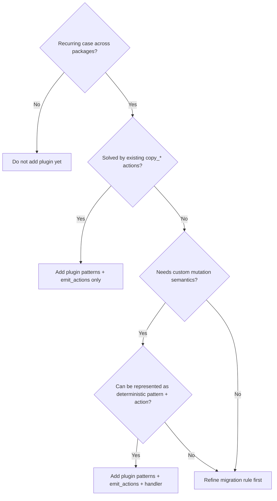
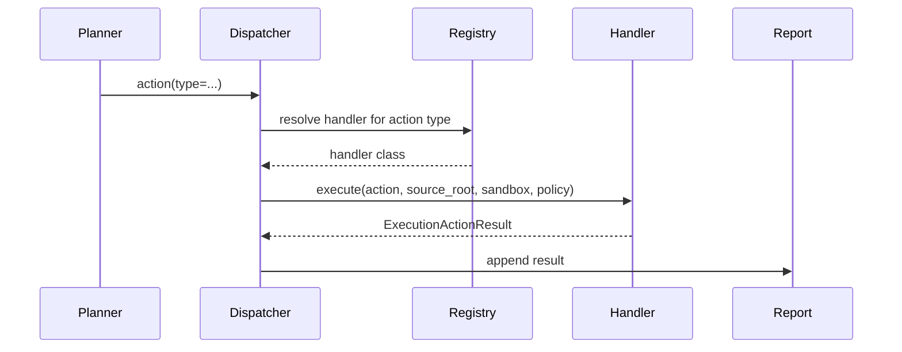

# Extension Guide
## Plugin Development for Migration Jobs

This guide is the end-to-end playbook for building a plugin in this repository:

- how to identify when a migration job needs a plugin
- how to implement each plugin area (patterns, planning, handlers)
- how to test the plugin
- how to install and operate it in the platform

The extension surface is the `DitaPlugin` protocol.

## Plugin Lifecycle at a Glance


```mermaid
flowchart LR
    A[Discovery Artifacts] --> B[Plugin Patterns]
    B --> C[Evidence on Artifacts]
    C --> D[Plugin emit_actions]
    D --> E[Plan Actions]
    E --> F[Execution Handlers]
    F --> G[Execution Report]
```

Key rule: each layer has one responsibility.

- Patterns describe what was observed.
- Planning actions describe what should happen.
- Handlers perform how it happens.

## 1. Identify When a Migration Job Needs a Plugin

### Overview

A plugin is justified when migration logic is corpus-specific or business-specific and should not be hardcoded into core behavior.

### Concept

Start from artifacts, not assumptions:

- discovery report: what structures exist
- plan output: what the system intends to do
- execution report: what actually happened

If the same transformation need appears repeatedly and is not cleanly representable by existing core behavior, introduce a plugin.

### Task Instructions

1. Collect 5-20 representative packages for the migration job.
2. Run discovery and planning on those packages.
3. Record recurring structural cases that require special routing or semantic edits.
4. Group those cases into named pattern candidates.
5. Decide whether each case can be solved by:
   - existing action types (`copy_map`, `copy_topic`, `copy_media`) with custom planning logic
   - or a new action type + handler

Useful commands during case discovery:

```bash
python3 -m dita_package_processor discover \
  --package /path/to/package \
  --output ./build/discovery.json

python3 -m dita_package_processor normalize \
  --input ./build/discovery.json \
  --output ./build/planning_input.json

python3 -m dita_package_processor plan \
  --input ./build/planning_input.json \
  --output ./build/plan.json
```

Decision flow:


```mermaid
flowchart TD
    Q1{Recurring case across packages?}
    Q2{Solved by existing copy_* actions?}
    Q3{Needs custom mutation semantics?}
    Q4{Can be represented as deterministic pattern + action?}
    N1[Do not add plugin yet]
    N2[Add plugin patterns + emit_actions only]
    N3[Add plugin patterns + emit_actions + handler]
    N4[Refine migration rule first]

    Q1 -- No --> N1
    Q1 -- Yes --> Q2
    Q2 -- Yes --> N2
    Q2 -- No --> Q3
    Q3 -- Yes --> Q4
    Q3 -- No --> N4
    Q4 -- Yes --> N3
    Q4 -- No --> N4
```

## 2. Create the Plugin Package

### Overview

A plugin is a separate installable Python package registered by entry point.

### Concept

The loader resolves plugins from the entry-point group:

- group: `dita_package_processor.plugins`
- core plugin always loads first
- third-party plugins load alphabetically by entry-point name

### Task Instructions

1. Create a package directory, for example `acme_dita_migration`.
2. Add `pyproject.toml` with entry-point registration.
3. Implement a `DitaPlugin` subclass.
4. Export a module-level instance named `plugin`.

Recommended layout:

```text
acme_dita_migration/
  pyproject.toml
  acme_dita_migration/
    __init__.py
    plugin.py
    patterns.py
    handlers/
      __init__.py
      route_special_topic.py
  tests/
    test_patterns.py
    test_emit_actions.py
    test_handlers.py
```

`pyproject.toml` example:

```toml
[project]
name = "acme-dita-migration"
version = "0.1.0"
requires-python = ">=3.10"
dependencies = ["dita-package-processor>=0.1.0"]

[project.entry-points."dita_package_processor.plugins"]
acme_dita_migration = "acme_dita_migration:plugin"
```

`acme_dita_migration/__init__.py`:

```python
from acme_dita_migration.plugin import AcmeDitaMigrationPlugin

plugin = AcmeDitaMigrationPlugin()
```

`acme_dita_migration/plugin.py` minimal skeleton:

```python
from dita_package_processor.plugins.protocol import DitaPlugin


class AcmeDitaMigrationPlugin(DitaPlugin):
    @property
    def name(self) -> str:
        return "com.acme.dita_migration"

    @property
    def version(self) -> str:
        return "0.1.0"
```

## 3. Pattern Contribution (`patterns()`)

### Overview

Patterns add discovery signals that generate evidence for planning.

### Concept

Each `Pattern` must define:

- `id` (globally unique across all loaded plugins)
- `applies_to` (`map`, `topic`, or `media`)
- `signals` (conditions)
- `asserts` (`role`, `confidence`)
- `rationale` (human-readable explanation)

Pattern IDs are global. Prefix with plugin namespace.

### Task Instructions

1. Name each pattern with a stable namespaced ID.
2. Keep `asserts.role` stable because planning logic routes on that role.
3. Keep signals deterministic and observable.
4. Return a list from `patterns()`.

Example:

```python
from dita_package_processor.discovery.patterns import Pattern


def migration_patterns() -> list[Pattern]:
    return [
        Pattern(
            id="com.acme.dita_migration.special_map_by_filename",
            applies_to="map",
            signals={"filename": {"equals": "SpecialMap.ditamap"}},
            asserts={"role": "special_map", "confidence": 1.0},
            rationale=["SpecialMap.ditamap is the migration root map."],
        ),
        Pattern(
            id="com.acme.dita_migration.glossary_topic_by_root",
            applies_to="topic",
            signals={"root_element": {"equals": "concept"}},
            asserts={"role": "candidate_glossary_topic", "confidence": 0.7},
            rationale=["Concept topics are candidates for glossary normalization."],
        ),
    ]
```

Wiring in plugin:

```python
def patterns(self):
    return migration_patterns()
```

## 4. Planning Contribution (`emit_actions(...)`)

### Overview

Planning transforms evidence into deterministic action templates.

### Concept

`emit_actions(artifact, evidence, context)` is called once per artifact for each plugin.

Action templates must include:

- `type`
- `target`
- `parameters`
- `reason`
- `derived_from_evidence`

Do not include `id`; planner assigns IDs globally.

### Task Instructions

1. Read roles from evidence.
2. Decide whether the current artifact should emit an action.
3. Build package-relative target paths deterministically.
4. Emit action templates with clear reasons.
5. Return `[]` when artifact is not applicable.

Example:

```python
from pathlib import Path
from typing import Any


def emit_actions(self, artifact, evidence: list[dict[str, Any]], context):
    roles = {ev.get("asserted_role") for ev in evidence}

    if artifact.artifact_type == "map" and "special_map" in roles:
        source_path = artifact.path
        target_path = f"target/maps/{Path(source_path).name}"
        return [
            {
                "type": "copy_map",
                "target": target_path,
                "parameters": {
                    "source_path": source_path,
                    "target_path": target_path,
                },
                "reason": "Route special map into migration target/maps.",
                "derived_from_evidence": [
                    ev["pattern_id"] for ev in evidence if ev.get("pattern_id")
                ],
            }
        ]

    if artifact.artifact_type == "topic" and "candidate_glossary_topic" in roles:
        source_path = artifact.path
        target_path = f"target/topics/{Path(source_path).name}"
        return [
            {
                "type": "copy_topic",
                "target": target_path,
                "parameters": {
                    "source_path": source_path,
                    "target_path": target_path,
                },
                "reason": "Route glossary candidate topic for downstream processing.",
                "derived_from_evidence": [
                    ev["pattern_id"] for ev in evidence if ev.get("pattern_id")
                ],
            }
        ]

    return []
```

Execution implication:

- if you emit built-in `copy_*` actions, built-in handlers can execute them
- if you emit a custom `type`, you must provide a handler for that action type

## 5. Handler Contribution (`handlers()`)

### Overview

Handlers execute action types and return `ExecutionActionResult`.

### Concept

A handler class must:

- inherit `ExecutionHandler`
- define `action_type` as a class attribute
- implement `execute(...)`

Handler result statuses are:

- `success`
- `failed`
- `skipped`

### Task Instructions

1. Decide whether you need a new action type.
2. Implement strict parameter validation.
3. Enforce source/sandbox boundaries.
4. Respect `dry_run`.
5. Return structured `ExecutionActionResult`.
6. Register handler class from plugin `handlers()`.

Example custom handler:

```python
import shutil
from pathlib import Path
from typing import Any, Dict

from dita_package_processor.execution.models import ExecutionActionResult
from dita_package_processor.execution.registry import ExecutionHandler
from dita_package_processor.execution.safety.policies import (
    MutationPolicy,
    PolicyViolationError,
)
from dita_package_processor.execution.safety.sandbox import Sandbox


class RouteSpecialTopicHandler(ExecutionHandler):
    action_type = "com.acme.route_special_topic"

    def execute(
        self,
        *,
        action: Dict[str, Any],
        source_root: Path,
        sandbox: Sandbox,
        policy: MutationPolicy,
    ) -> ExecutionActionResult:
        action_id = str(action.get("id", "<unknown>"))
        params = action.get("parameters", {})
        dry_run = bool(action.get("dry_run", False))

        try:
            rel_source = Path(params["source_path"])
            rel_target = Path(params["target_path"])
        except KeyError as exc:
            return ExecutionActionResult(
                action_id=action_id,
                status="failed",
                handler=self.__class__.__name__,
                dry_run=dry_run,
                message="Missing required parameters: source_path, target_path",
                error=str(exc),
            )

        source_path = (source_root / rel_source).resolve()
        if not source_path.is_relative_to(source_root):
            return ExecutionActionResult(
                action_id=action_id,
                status="failed",
                handler=self.__class__.__name__,
                dry_run=dry_run,
                message="source_path escapes source_root",
                error="PathTraversalError",
            )

        target_path = sandbox.resolve(rel_target)

        if dry_run:
            return ExecutionActionResult(
                action_id=action_id,
                status="skipped",
                handler=self.__class__.__name__,
                dry_run=True,
                message=f"Dry-run: would copy {rel_source} -> {rel_target}",
            )

        if not source_path.exists() or not source_path.is_file():
            return ExecutionActionResult(
                action_id=action_id,
                status="failed",
                handler=self.__class__.__name__,
                dry_run=False,
                message=f"Source file does not exist: {source_path}",
                error="InvalidSource",
            )

        try:
            policy.validate_target(target_path)
            target_path.parent.mkdir(parents=True, exist_ok=True)
            shutil.copy2(source_path, target_path)
        except PolicyViolationError as exc:
            return ExecutionActionResult(
                action_id=action_id,
                status="failed",
                handler=self.__class__.__name__,
                dry_run=False,
                message=str(exc),
                error=exc.failure_type,
            )

        return ExecutionActionResult(
            action_id=action_id,
            status="success",
            handler=self.__class__.__name__,
            dry_run=False,
            message=f"Copied {rel_source} -> {rel_target}",
            metadata={
                "source_path": rel_source.as_posix(),
                "target_path": rel_target.as_posix(),
            },
        )
```

Register in plugin:

```python
from acme_dita_migration.handlers.route_special_topic import RouteSpecialTopicHandler


def handlers(self):
    return [RouteSpecialTopicHandler]
```

Execution dispatch path:


```mermaid
sequenceDiagram
    participant Planner
    participant Dispatcher
    participant Registry
    participant Handler
    participant Report

    Planner->>Dispatcher: action(type=...)
    Dispatcher->>Registry: resolve handler for action type
    Registry-->>Dispatcher: handler class
    Dispatcher->>Handler: execute(action, source_root, sandbox, policy)
    Handler-->>Dispatcher: ExecutionActionResult
    Dispatcher->>Report: append result
```

## 6. Add the Plugin to the Platform

### Overview

"Add to platform" means install the plugin package in the runtime environment that executes the pipeline.

### Concept

Entry points are discovered from installed packages. If the plugin is not installed in the active environment, it does not exist to the platform.

### Task Instructions

1. Install plugin into the same environment as `dita_package_processor`.
2. Validate structure with CLI.
3. Confirm plugin appears in plugin registry introspection commands.
4. Run migration smoke test with report output.

Commands:

```bash
# from plugin root
python3 -m pip install -e .

# structural checks
python3 -m dita_package_processor plugin validate .
python3 -m dita_package_processor plugin list
python3 -m dita_package_processor plugin info com.acme.dita_migration

# pipeline smoke run
python3 -m dita_package_processor run \
  --package /path/to/fixture-package \
  --docx-stem OutputDoc \
  --target ./build \
  --report ./build/execution-report.json
```

If using custom action types, confirm no registry conflict at startup:

- duplicate pattern IDs fail the registry
- duplicate handler `action_type` fails the registry

## 7. Testing Strategy for Plugins

### Overview

Test each plugin layer separately, then test the full vertical slice.

### Concept

Minimum test stack:

- pattern tests
- planning emission tests
- handler tests
- plugin validation/integration tests

### Task Instructions

1. Unit-test `patterns()` output shape and IDs.
2. Unit-test `emit_actions()` for expected evidence combinations.
3. Unit-test handler `execute()` success/failure/dry-run.
4. Run `plugin validate` in CI for structure checks.
5. Add integration test that runs pipeline on a fixture package and inspects report results.

Suggested test matrix:

| Layer | What to assert |
|------|-----------------|
| Pattern | Correct pattern IDs and declared roles |
| Planning | Deterministic action templates; no `id` field |
| Handler | Correct status/message/metadata and file effects |
| Integration | Plugin is loaded; expected actions executed |

Pattern unit test example:

```python
from acme_dita_migration.plugin import AcmeDitaMigrationPlugin


def test_patterns_are_namespaced():
    plugin = AcmeDitaMigrationPlugin()
    ids = [p.id for p in plugin.patterns()]
    assert ids
    assert all(pid.startswith("com.acme.dita_migration.") for pid in ids)
```

Planning emission unit test example:

```python
from acme_dita_migration.plugin import AcmeDitaMigrationPlugin
from dita_package_processor.planning.contracts.planning_input import PlanningArtifact


def test_emit_actions_routes_special_map():
    plugin = AcmeDitaMigrationPlugin()
    artifact = PlanningArtifact(
        path="SpecialMap.ditamap",
        artifact_type="map",
        classification="content",
        metadata={},
    )
    evidence = [
        {
            "pattern_id": "com.acme.dita_migration.special_map_by_filename",
            "asserted_role": "special_map",
            "confidence": 1.0,
            "rationale": ["test"],
        }
    ]

    actions = plugin.emit_actions(artifact, evidence, context=None)
    assert len(actions) == 1
    assert actions[0]["type"] == "copy_map"
    assert "id" not in actions[0]
```

Handler unit test pattern (filesystem-safe):

```python
from pathlib import Path

from acme_dita_migration.handlers.route_special_topic import RouteSpecialTopicHandler
from dita_package_processor.execution.safety.policies import MutationPolicy, OverwritePolicy
from dita_package_processor.execution.safety.sandbox import Sandbox


def test_route_special_topic_handler_success(tmp_path: Path):
    source_root = tmp_path
    sandbox = Sandbox(tmp_path)
    policy = MutationPolicy(overwrite=OverwritePolicy.REPLACE)

    source = tmp_path / "topics" / "a.dita"
    target = tmp_path / "target" / "topics" / "a.dita"
    source.parent.mkdir(parents=True, exist_ok=True)
    source.write_text("<topic/>", encoding="utf-8")

    action = {
        "id": "a1",
        "type": "com.acme.route_special_topic",
        "parameters": {
            "source_path": "topics/a.dita",
            "target_path": "target/topics/a.dita",
        },
        "dry_run": False,
    }

    handler = RouteSpecialTopicHandler()
    result = handler.execute(
        action=action,
        source_root=source_root,
        sandbox=sandbox,
        policy=policy,
    )

    assert result.status == "success"
    assert target.exists()
```

## 8. Platform Constraints and Advanced Notes

- Pattern IDs must be globally unique across all loaded plugins.
- Handler `action_type` values must be globally unique across all loaded plugins.
- The plan schema is contract-enforced; if you introduce a brand-new action type, treat that as a platform contract change and update schema/tests/docs accordingly.
- `CorePlugin` loads first and is the reference implementation for style and behavior.

## 9. Rollout Checklist

1. Define migration scope and success criteria.
2. Implement pattern(s) with namespaced IDs.
3. Implement deterministic `emit_actions`.
4. Implement handler(s) or reuse existing `copy_*` handlers.
5. Add unit and integration tests.
6. Validate plugin with CLI.
7. Install in runtime environment.
8. Run dry-run on representative corpus.
9. Run apply mode on staging corpus.
10. Review execution reports before production rollout.
