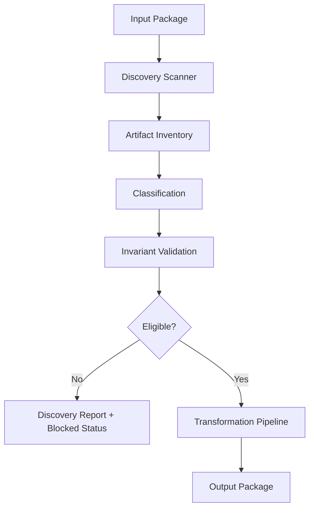
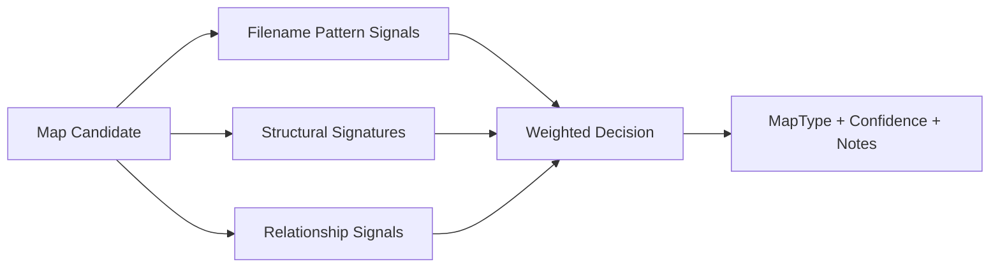
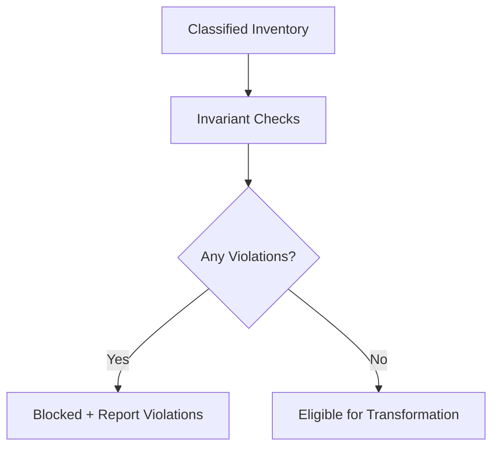
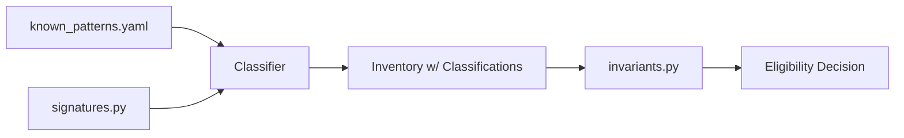
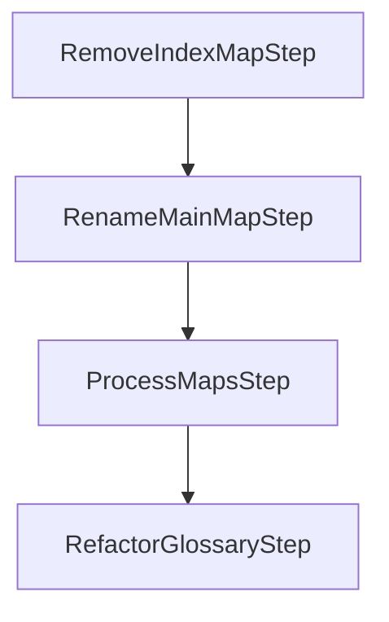

# Hardening Plan

This document defines the hardening strategy for the **DITA Package Processor** so it survives real-world vendor exports, inconsistent map structures, and surprising corpus variations.

Hardening is not “adding more heuristics.” It is:
- **Separating discovery from transformation**
- **Classifying artifacts explicitly**
- **Validating invariants**
- **Transforming only when eligibility is proven**
- **Encoding knowledge in data + tests, not vibes**

---

## Goals

### Primary goals
- Process real DITA packages without silent corruption
- Produce deterministic, explainable outcomes
- Fail safely (block transformation when ambiguity is high)
- Make new corpus variations cheap to onboard

### Non-goals
- Interactive repair
- “AI-driven interpretation” at runtime
- Automatically fixing invalid XML beyond safe parsing
- Guessing intent based on fuzzy signals

---

## Architectural Pivot

The key change is an explicit two-stage system:

1. **Discovery Stage** (read-only, diagnostic)
2. **Transformation Stage** (mutating, deterministic)

Discovery produces a report. Transformation consumes that report (or the same rules) and refuses to run if eligibility is not met.

### Why this matters
Most failures in real packages come from assumptions:
- “there is one main map”
- “abstract map looks like X”
- “definitions map exists”
- “map titles are present”
- “topicrefs are structured consistently”

The hardening strategy treats those assumptions as **invariants** that must be validated before transformation.

---

## System Overview

### What this diagram shows
- Discovery is **always safe** and produces a usable report.
- Transformation is conditional. If eligibility fails, the processor stops before mutating anything.

---

## Discovery Stage

Discovery is the safety net and the corpus-learning engine.

### Discovery outputs
- A complete inventory of maps and topics
- Per-artifact classification (with confidence + notes)
- Invariant validation results
- Blocking issues (what must be resolved before transform)
- Recommendations and next actions

### Discovery responsibilities
- Parse XML safely
- Identify artifacts and relationships (refs)
- Classify maps into explicit types
- Identify unknowns and conflicts
- Validate invariants and compute eligibility

### Discovery never does
- Rename files
- Modify map structure
- Create wrapper topics
- Convert definition topics into glossentries

---

## Classification Model

Classification is the contract that replaces ad-hoc logic.

### Map types
- **MAIN**: the primary content map
- **ABSTRACT**: a map that contributes an abstract/summary topic
- **CONTENT**: normal content maps to be wrapped/numbered
- **GLOSSARY**: definition/glossary map used for glossentry conversion
- **CONTAINER**: structural wrappers (often vendor scaffolding)
- **UNKNOWN**: cannot be classified with current patterns

### Classification pipeline (conceptual)

### Notes
- Filename-only rules are weak signals and should not dominate.
- Structural signatures should be strongly weighted.
- Relationship signals include:
  - referenced by `index.ditamap`
  - referenced by other maps
  - contains mostly `mapref` vs `topicref`

---

## Invariants

Invariants are explicit rules that must hold for safe transformation.

### Examples
- Exactly one MAIN map must exist
- At most one ABSTRACT map
- At most one GLOSSARY map (unless multi-glossary is an explicit feature)
- No UNKNOWN maps (or UNKNOWN maps must be explicitly ignored)
- Entry-point resolution must succeed (`index.ditamap` → main map)

### Invariant validation flow

### Severity levels
- **BLOCKING**: transformation must not run (risk of corrupt output)
- **WARNING**: transformation can run but must log and record risk
- **INFO**: diagnostic only

---

## Knowledge System

Hardening depends on encoding corpus knowledge in a structured way.

### Knowledge artifacts
- `known_patterns.yaml`  
  Declarative patterns for classification and recognition.
- `signatures.py`  
  Structural signatures for maps/topics.
- `invariants.py`  
  Eligibility rules.
- `map_types.py`  
  Formal enum/type definition.

### Knowledge-driven flow

### Design constraint
Patterns must be:
- explicit
- test-backed
- reviewable
- easy to extend without rewriting classifier code

---

## Transformation Stage

Transformation stays deterministic. Hardening is not “making it smarter,” it is “making it safer.”

### Safe transformation contract
Transformation may only run when:
- discovery is eligible (no blocking invariants)
- main map is identified and resolved
- abstract handling rules are unambiguous
- content maps are classified and stable

### Transformation pipeline (current)

### Hardening emphasis
- The pipeline should consume discovery outputs or share the same classification logic.
- Each step must validate its preconditions and fail loudly if the contract is broken.

---

## Failure Modes and Hardening Responses

### Common failure: multiple “main” candidates
**Cause:** vendor package contains multiple container maps that look “main-ish.”  
**Response:** classify as CONTAINER vs MAIN using relationship signals (index references) and structural signatures.

### Common failure: glossary map included in wrapping
**Cause:** content-normalization step treats glossary map as content map.  
**Response:** classification must exclude GLOSSARY from wrapping. Only CONTENT maps are wrapped.

### Common failure: abstract map missing topicref href
**Cause:** abstract map exists but does not reference a topic in expected way.  
**Response:** treat as WARNING or BLOCKING depending on strictness settings. Log details and include in report.

### Common failure: UNKNOWN maps exist
**Cause:** legacy or vendor scaffolding map not recognized.  
**Response:** block transformation by default unless explicitly ignored via configuration.

---

## Development Matrix

This matrix defines phased hardening deliverables.

| Phase | Goal | Deliverables | Tests | Risk |
|------|------|--------------|------|------|
| 0 | Stabilize baseline | consistent XML IO, stable APIs | unit tests for xml helpers | low |
| 1 | Discovery MVP | scanner, classifiers, models, report | inventory + classification tests | medium |
| 2 | Invariants | invariant engine + blocking behavior | invariant fixture tests | medium |
| 3 | Knowledge onboarding | known_patterns.yaml + signature library | pattern-driven classification tests | medium |
| 4 | Transform gating | transformation refuses when not eligible | end-to-end: blocked vs eligible | high |
| 5 | Corpus hardening | add patterns for real packages | regression fixtures from corpus | high |

---

## Testing Strategy

### Testing tiers
1. **Unit tests**: signatures, classification, invariants
2. **Integration tests**: discovery on fixture packages
3. **End-to-end tests**: discovery + transformation with eligibility gating
4. **Regression suite**: archived fixtures representing real vendor patterns

### Golden fixtures
A hardening program lives or dies based on fixtures:
- each new pattern must include a minimal representative fixture
- fixtures must be small and targeted (not entire corpora)
- fixtures should include “almost matches” to prevent overfitting

---

## Logging and Observability

### Minimum logging requirements
- Discovery writes a structured report artifact
- Transformation logs:
  - which maps were classified as what
  - which maps were wrapped
  - which files were modified
  - warnings and exceptions with file context

### Suggested log format
- include package root
- include artifact path
- include classification and confidence
- include invariant ID on failures

---

## How to Use ChatGPT to Speed Up Hardening

ChatGPT should accelerate **analysis and codification**, not “decision making at runtime.”

### Good uses
- Summarize structural differences between two map samples
- Propose candidate signatures (that you then convert into tests)
- Draft YAML pattern definitions from observed XML structures
- Generate pytest fixtures and regression tests
- Refactor code for clarity while preserving behavior

### Bad uses
- Using ChatGPT output as runtime logic without tests
- “Let the model decide what the map is”
- Hidden heuristics not encoded in `known_patterns.yaml` + tests

### Operating rule
Every ChatGPT-derived idea must become:
1. explicit rule/signature/pattern
2. test
3. documentation entry

No exceptions.

---

## Next Implementation Steps

1. Implement Discovery modules:
   - `discovery/models.py`
   - `discovery/scanner.py`
   - `discovery/signatures.py`
   - `discovery/classifiers.py`
   - `discovery/report.py`

2. Implement Knowledge modules:
   - `knowledge/map_types.py`
   - `knowledge/invariants.py`
   - `knowledge/known_patterns.yaml`

3. Add discovery CLI subcommand or mode:
   - `dita_package_processor discover -i <pkg> -o <report>`

4. Gate transformation:
   - refuse to transform if blocking invariants exist

5. Build regression fixture library:
   - add one fixture per pattern
   - add one fixture per failure mode

---

## Appendix: What “Done” Looks Like

Hardening is “done enough” when:
- discovery classifies 95%+ of maps on real corpora
- unknowns are explicit and block transformations
- adding a new pattern is a 30-minute task:
  - add fixture
  - add YAML pattern
  - add test
  - rerun discovery
- transformation does not mutate packages that are not eligible