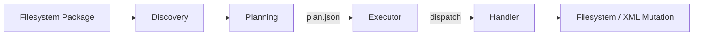
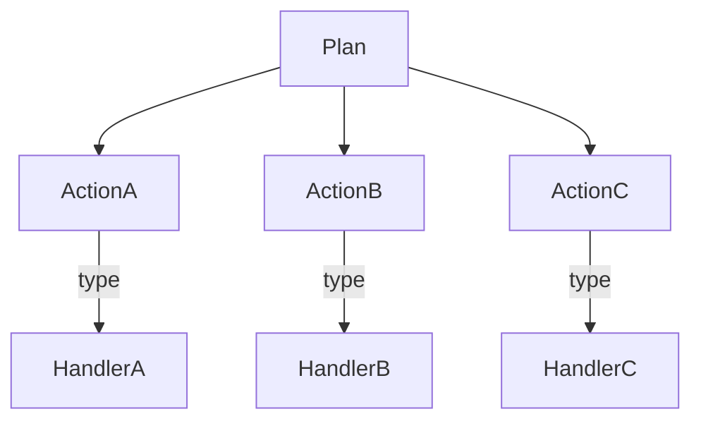
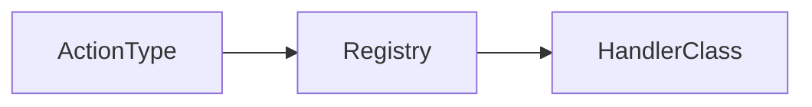

# Developing and Implementing a Handler  
*DITA Package Processor – Developer Guide*

This document explains how to design, implement, register, and test **execution handlers** in the DITA Package Processor. Handlers are the concrete execution units that apply **planned actions** to the filesystem or to DITA content.

This guide exists to support **incremental migration work**, where new structural cases are discovered over time and expressed as new actions and handlers—without turning the system into a script pile.

---

## Overview

The DITA Package Processor follows a strict, artifact-driven pipeline:

1. **Discovery** inspects the input package and emits structured evidence
2. **Planning** produces an explicit, ordered execution plan (`plan.json`)
3. **Execution** applies that plan using registered handlers

Handlers live entirely in the **execution layer**. They:

- Implement exactly one action type
- Operate only on validated action dictionaries
- Rely on explicit path resolution (`source_root`, `sandbox`)
- Produce structured `ExecutionActionResult` objects
- Contain no discovery or planning logic

### High-Level Architecture



---

## Conceptual Model

### What Is a Handler?

A handler is a **concrete execution implementation** for a single action type.

It answers exactly one question:

> “Given this action, how do I apply it safely and deterministically?”

Handlers do **not**:

- Decide *whether* an action should exist
- Inspect the broader package to infer intent
- Modify or reorder plans
- Communicate with other handlers

They execute. That’s it.

---

### Relationship Between Plan and Handlers



Each action’s `type` must map to **exactly one** handler.  
If no handler is registered, execution fails fast.

That failure is intentional.

---

## Handler Categories: Semantic vs Filesystem

Handlers fall into two **intentionally separate** categories.  
Do not blur this boundary.

---

### 1. Semantic Handlers (Content-Aware)

Semantic handlers understand **DITA semantics and XML structure**.  
They parse XML, reason about elements, and mutate meaning.

Location:
```
dita_package_processor/execution/handlers/semantic/
```

Naming pattern:
```
s_<verb>_<concept>.py
```

Examples:
- `s_wrap_map.py`
- `s_inject_topicrefs.py`
- `s_extract_glossary.py`
- `s_inject_glossary.py`
- `s_delete_file.py` (semantic deletion)
- `s_copy_map.py` (semantic copy, not blind I/O)

Semantic handlers:

- parse XML
- modify trees
- preserve DITA correctness
- enforce idempotence where possible
- require correct path resolution

They answer:

> *How should this content be transformed?*

---

### 2. Filesystem Handlers (Artifact Transport)

Filesystem handlers operate on **paths and bytes only**.  
They are intentionally ignorant of DITA semantics.

Location:
```
dita_package_processor/execution/handlers/filesystem/
```

Examples:
- `filesystem.py` (copy helpers)
- `fs_copy_topic.py`
- `fs_copy_media.py`

Filesystem handlers:

- use `shutil.copy2`
- create parent directories
- enforce sandbox boundaries
- do byte-for-byte copies
- never parse XML
- never infer meaning

They answer:

> *How should this artifact be moved safely?*

---

### Why This Separation Exists

Semantic handlers manipulate *meaning*.  
Filesystem handlers manipulate *matter*.

Mixing them guarantees corruption.

This separation ensures:

- deterministic execution
- auditability
- safe escalation from dry-run to apply
- executor portability
- zero “magic” behavior

Once filesystem handlers exist, execution becomes real.  
That transition must stay surgical.

---

## Writing a Handler (Current Model)

### 1. Choose the Action Type

Action types are stable API contracts:

Examples:
- `copy_map`
- `delete_file`
- `inject_topicref`
- `wrap_map`

Once used in plans or tests, an action type should be treated as **stable**.

---

### 2. Create the Handler Module

Handlers live under:

```
dita_package_processor/
└── execution/
    └── handlers/
        ├── semantic/
        └── filesystem/
```

Example:
```
execution/handlers/semantic/s_wrap_map.py
```

---

### 3. Implement the Handler Class

Handlers are **class-based** and registered via the execution registry.

Canonical shape:

```python
class WrapMapHandler(ExecutionHandler):
    action_type = "wrap_map"

    def execute(
        self,
        *,
        action: Dict[str, Any],
        sandbox: Sandbox,
        policy: MutationPolicy,
    ) -> ExecutionActionResult:
        ...
```

Key points:

- `action` is already schema-validated
- All paths must be resolved via `sandbox` or `source_root`
- Never construct raw `Path()` from plan data
- Always return an `ExecutionActionResult`

---

### 4. Validate Inputs Explicitly

Even though planning is strict, handlers **must revalidate defensively**.

Minimum checklist:

- Required parameters exist
- Target path is present (if required)
- Source file exists
- File vs directory distinction
- Dry-run handling

Example pattern:

```python
try:
    rel_target = Path(params["target_path"])
except KeyError as exc:
    return ExecutionActionResult(
        action_id=action_id,
        status="failed",
        handler=self.__class__.__name__,
        dry_run=dry_run,
        message="Missing required parameter: target_path",
        error=str(exc),
    )
```

Assume nothing. Fail loudly.

---

### 5. Resolve Paths Correctly

All path resolution must be explicit and safe:

- Reads:
  - `source_root / relative_path`
- Writes:
  - `sandbox.resolve(relative_path)`

Never:
- Use `cwd`
- Infer paths
- Accept absolute paths from plan data

This is non-negotiable.

---

### 6. Implement the Mutation

Keep mutations:

- Minimal
- Deterministic
- Single-purpose

Example:

```python
target_path.parent.mkdir(parents=True, exist_ok=True)
shutil.copy2(source_path, target_path)
```

No hidden side effects. No opportunistic fixes.

---

### 7. Idempotence (Strongly Encouraged)

If an action might run twice, handlers should safely no-op.

Examples:
- Topicref already exists
- Wrapper already present
- Target already copied

Pattern:

```python
if target_path.exists():
    return ExecutionActionResult(
        action_id=action_id,
        status="skipped",
        handler=self.__class__.__name__,
        dry_run=False,
        message="Target already exists",
    )
```

Idempotence makes reruns survivable.

---

## Registering the Handler

Handlers are registered via the **execution registry**.

Conceptually:



Registration occurs when the module is imported.  
If an action type has no handler, execution fails immediately.

This is intentional and desirable.

---

## Testing a Handler (Current Practice)

Handlers are tested **via execution tests**, not isolated unit tests.

### Why Not Unit Tests?

- Handlers depend on filesystem state
- Sandbox and policy enforcement matter
- Action ordering matters

The canonical tests live under:

```
tests/execution/
tests/integration/
```

### What “Tested” Means

A handler is considered tested when:

- A plan emits its action
- Execution runs (dry-run and apply)
- The filesystem reflects the expected result
- The execution report records the outcome

Assertions focus on:
- File existence or removal
- XML structure changes
- Idempotence
- Correct status (`success`, `skipped`, `failed`)

The test suite is the specification.

---

## Principles for Handler Design (Non-Negotiable)

### 1. One Action, One Responsibility

Never combine mutations.

Bad:
- Copying a file and deleting another
- Injecting multiple unrelated structures

Good:
- One handler, one mutation

---

### 2. No Planning Logic in Handlers

Handlers never:
- Discover files
- Decide relevance
- Filter actions

That belongs in planning.

---

### 3. Fail Fast and Loud

Silent failure is forbidden.

Prefer:
- Explicit `failed` results
- Clear error messages

Avoid:
- Swallowed exceptions
- Implicit returns on error

---

### 4. Determinism Above All

Given the same filesystem and action:
- Same result
- Same status
- Same report

No randomness. No timestamps. No globals.

---

### 5. Semantic Honesty

If an action references something conceptually important:

- Validate it
- Even if not strictly required today

This keeps plans honest and future-proof.

---

### 6. Handlers Are Boring on Purpose

Clever handlers become liabilities.

Optimize for:
- Readability
- Obviousness
- Your future self under pressure

---

## Final Guidance for Future You

When a migration gets weird (it will):

1. Name the pattern
2. Encode the intent as an action
3. Implement the smallest possible handler
4. Lock it with an execution test
5. Move on

If you feel tempted to “just fix it in the handler,” stop.

That’s how pipelines rot.

This system is doing exactly what it should.  
The friction is the safety working.