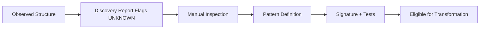

# Guidance: Documenting New Patterns

This is where your future self will either thank you or curse you.

Documenting patterns is **not** about clever heuristics.  
It’s about turning observed reality into **repeatable knowledge**.

---

## When a New Pattern Is Needed

You should document a new pattern when **any** of the following occur:

- A map consistently appears as `UNKNOWN`
- A map behaves differently than existing MapTypes
- A vendor export introduces a stable but unfamiliar structure
- A transformation step requires special handling

Do **not** add patterns:
- “just in case”
- to silence errors
- to make tests pass

---

## Pattern Lifecycle



If you skip a step, you’re guessing.

---

## Pattern Definition Checklist

Every new pattern must answer **all** of the following:

### 1. What does this artifact represent?

- Content?
- Container?
- Legacy wrapper?
- Vendor-specific construct?

Write this in plain language.

---

### 2. What makes it identifiable?

Acceptable signals:
- root element structure
- presence/absence of `mapref` vs `topicref`
- consistent navtitle usage
- known filename conventions (last resort)

Unacceptable signals:
- positional assumptions
- sibling ordering
- “usually looks like…”

---

### 3. What MapType does it map to?

Choose one:
- MAIN
- ABSTRACT
- CONTENT
- GLOSSARY
- CONTAINER
- UNKNOWN (temporary)

If it doesn’t fit, that’s a design problem, not a classification error.

---

### 4. What invariants does it affect?

Answer explicitly:
- Does it change MAIN map uniqueness?
- Does it introduce multiple ABSTRACT-like maps?
- Does it alter glossary assumptions?

Update invariants if necessary.

---

## Encoding the Pattern

Patterns live in **data**, not code.

### Example: `known_patterns.yaml`

```yaml
- name: legacy_overview_map
  applies_to: ditamap
  match:
    filename_contains: "overview"
    requires:
      - mapref
      - topicref
  classify_as: CONTAINER
  confidence: medium
  notes: >
    Legacy Unison export pattern. Acts as a structural
    wrapper without semantic content.
```

---

## Required Follow-Up for Every Pattern

Every new pattern requires:

1. **Unit test**
2. **Sample fixture**
3. **Discovery report update**
4. **Documentation entry**

If you skip one, the pattern is not real.

---

## Anti-Patterns (Do Not Do This)

- “If filename contains X then Y”
- Regex-only classification
- Pattern definitions without examples
- Code-only classification logic
- Silent fallbacks

These are how tools rot.

---

## Some word of advice

Discovery is not about being *right*.  
It’s about being **honest**.

UNKNOWN is a feature.  
Blocking is a feature.  
Extra work now is cheaper than silent corruption later.

You’re doing the unglamorous part. That’s why this will last.