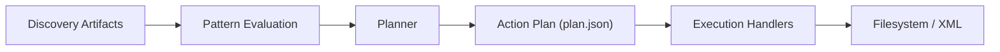
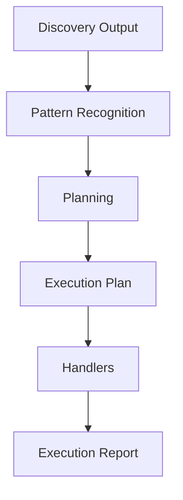
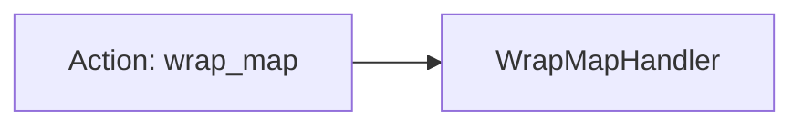
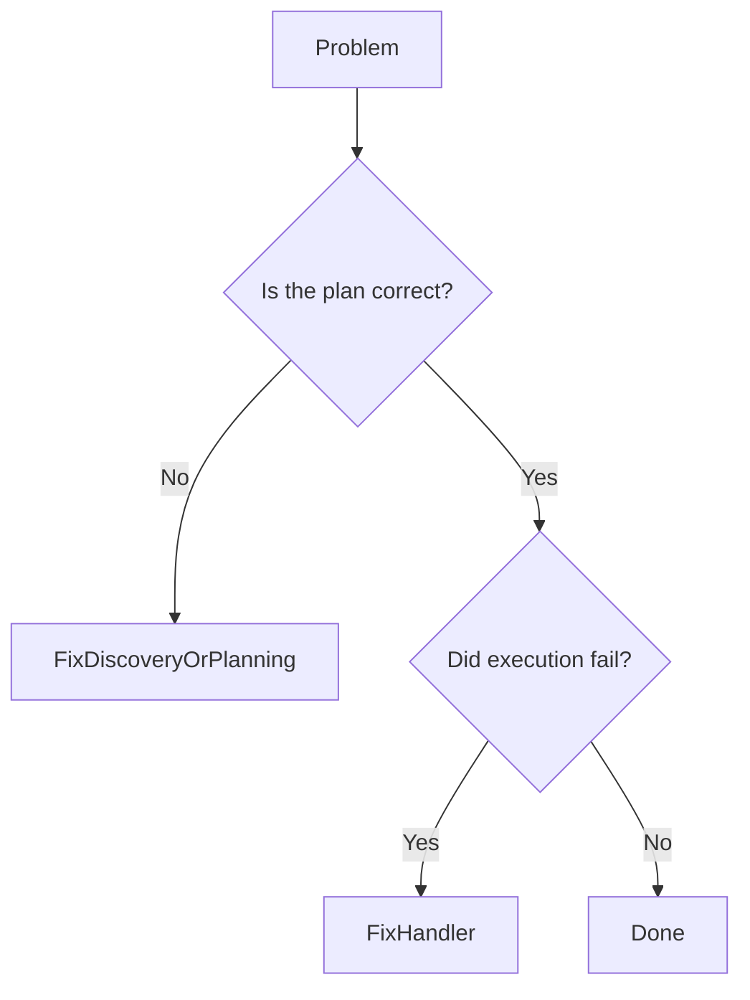

# Patterns, Actions, and Handlers  
*A Practical Mental Model for Deterministic Migrations*

The DITA Package Processor is built around a deliberately rigid stack:



This stack is not an implementation detail.  
It is the **mental model** you should use when working with the system.

Each layer answers exactly one question:

| Layer | Question |
|------|---------|
| Patterns | “What situation am I in?” |
| Actions | “What should happen?” |
| Handlers | “How is that applied safely?” |

They are not interchangeable.  
They are not shortcuts to each other.  
They exist to keep migrations explainable instead of mythical.

If you collapse these layers, debugging becomes archaeology.  
If you keep them separate, debugging becomes reading.

---

## The End-to-End Flow



Read this as:

> The system observes reality →  
> Recognizes known situations →  
> Declares intent →  
> Applies that intent →  
> Records exactly what happened.

Nothing skips layers.  
Nothing happens implicitly.

---

## Why This Stack Exists

Most migration systems fail because they mix:

- observation  
- decision-making  
- mutation  

into a single blob of logic.

That blob slowly turns into:
- undocumented behavior  
- unrepeatable runs  
- fixes that work “this one time”  
- engineers who are afraid to touch it  

This system prevents that by enforcing separation.

| If something goes wrong… | You know where to look |
|--------------------------|------------------------|
| Wrong structure detected | Discovery / Pattern recognition |
| Wrong intent declared | Planning / Plan |
| Wrong mutation applied | Handler |
| Wrong order of work | Plan |
| Silent failure | Not allowed by design |

The system feels heavy because it is carrying responsibility for you.

---

## Patterns  
**What you have learned about the corpus**

Patterns describe *observed reality*.  
They are not operations.  
They do not fix anything.

A pattern is a statement like:

> “This package contains an abstract map that is not directly referenced.”

Patterns answer:

> “What situation am I in?”

They never answer:

> “What should I do about it?”

That decision comes later.

### Where Patterns Live Now

Patterns are no longer a separate DSL or YAML file.  
They emerge from **discovery artifacts and normalized structure**.

Concretely:

- Discovery produces:
  - artifacts
  - relationships
  - graphs
  - evidence
- Planning evaluates those artifacts against known structural conditions
- Pattern recognition is *implicit but deterministic*

Patterns never mutate files.  
They only describe what *is*.

If a condition cannot be proven from discovery output, it is not treated as a pattern.

---

## Actions  
**Declarative intent**

Actions are pure data.  
They are the contract between planning and execution.

Example:

```json
{
  "id": "wrap-main-map",
  "type": "wrap_map",
  "target": "Main.ditamap",
  "parameters": {
    "source_map": "Main.ditamap",
    "title": "Main Content"
  },
  "reason": "Unwrapped top-level topicrefs detected"
}
```

Actions answer:

> “What should happen?”

They do **not** answer:

> “How do we do it?”

Actions must be:

- explicit  
- ordered  
- deterministic  
- schema-valid  
- reviewable before execution  

If something matters, it must be an action.

### Why Actions Matter

If execution does something surprising, the plan tells you whether that surprise was:

- intended  
- accidental  
- missing  
- misordered  

Execution never improvises.  
If the plan is wrong, execution is innocent.

---

## Handlers  
**Concrete, boring execution**

Handlers are where mutation happens.  
That is why they are tightly constrained.

A handler answers exactly one question:

> “Given this action, how do I apply it safely?”



Handlers:

- receive a validated action  
- resolve paths via `source_root` and sandbox rules  
- enforce mutation policy  
- touch the filesystem or XML  
- perform exactly one mutation  
- return structured execution results  

Handlers never:

- decide whether an action should exist  
- inspect the broader package  
- infer intent  
- reorder or skip actions  

Every handler corresponds to **exactly one** action type.

---

## Debugging With Artifacts (Not Guesswork)

This system is designed to be debugged with documents, not intuition.

| Artifact | What it tells you |
|--------|------------------|
| Discovery JSON | What the system observed |
| Plan JSON | What the system intended |
| Execution Report | What actually happened |

Debugging becomes mechanical:



You do not guess.  
You inspect.

---

## How to Extend the System Safely

When you encounter a new migration case:

1. **Name the pattern**  
   “This package contains glossary topics grouped under a definition map.”

2. **Declare the action**  
   “These topics should be converted into `glossentry` topics.”

3. **Implement the handler**  
   “Here is how that conversion happens safely and idempotently.”

4. **Lock it with a test**  
   So future runs cannot regress silently.

5. **Move on**

If you ever feel tempted to “just fix it in the handler,” stop.  
That is how migration systems turn into folklore.

---

## Summary: The Non-Negotiable Stack

| Layer | Role | Mutates Files |
|------|------|---------------|
| Patterns | Describe reality | No |
| Actions | Declare intent | No |
| Handlers | Apply change | Yes |

This structure is not academic.  
It is survival equipment.

It lets you:

- reason about failures  
- rerun safely  
- audit decisions  
- scale migrations  
- sleep after releases  

And when something breaks, it breaks honestly.