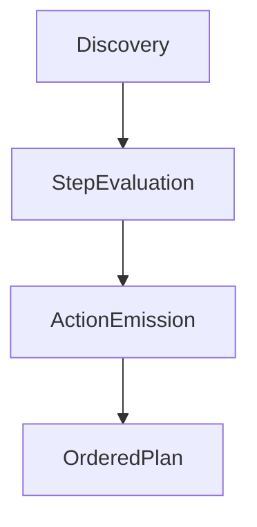

# How to Create a Plan  
*DITA Package Processor – Planning Guide*

This document explains **how execution plans are created** in the DITA Package Processor, what a plan represents, and how developers should extend planning safely as new migration cases emerge.

A plan is not a suggestion.  
A plan is not executable logic.  
A plan is a **contractual artifact**.

If execution does something, it is because the plan explicitly said so.

---

## What a Plan Is

A **plan** is a deterministic, schema-validated description of *intended actions* derived from discovery output.

It answers exactly one question:

> **“What should happen to this package, and why?”**

A plan:

- Is pure data (`plan.json`)
- Contains no executable code
- Is ordered and deterministic
- Is reviewable and diffable
- Is required for execution
- Is the only thing execution is allowed to trust

If something is not in the plan, it does not happen.

---

## Where Planning Lives

Planning is implemented in the **planning layer**, primarily:

```
dita_package_processor/planning/
├── planner.py
├── models.py
├── steps/
│   ├── base.py
│   ├── remove_index_map.py
│   ├── rename_main_map.py
│   ├── process_maps.py
│   └── refactor_glossary.py
```

Planning is *step-driven*.  
Each step contributes actions to a shared plan context.

---

## Inputs to Planning

Planning consumes **only** validated discovery output and explicit configuration.

### Required Inputs

- `DiscoveryInventory`
- Package root path
- CLI / config intent (e.g. `docx_stem`)
- Optional glossary configuration

Planning **never**:
- Re-scans the filesystem
- Guesses structure
- Infers missing data
- Touches the filesystem

If discovery didn’t prove it, planning cannot act on it.

---

## Planning Output

The result of planning is a **Plan** object, serialized as `plan.json`.

A valid plan contains:

- Metadata (version, timestamp)
- Source discovery reference
- Declared intent
- An ordered list of actions
- Optional invariants

Every plan must satisfy:

- Schema validity
- Non-empty action list (or explicit noop intent)
- Deterministic ordering

If those guarantees cannot be met, planning fails.

---

## The Core Planning Pattern

Planning follows a repeatable pattern:



Translated to words:

1. Inspect discovery output
2. Evaluate known patterns
3. Decide intent
4. Emit explicit actions
5. Order them deterministically

Planning does **not** execute those actions.

---

## Planning Steps

Planning is composed of **explicit steps**, executed in a fixed order.

Each step:

- Examines discovery state and planning context
- Emits zero or more actions
- Does not mutate shared state except via the plan

Example steps:

- Remove index map
- Rename main map
- Normalize map structure
- Refactor glossary

Steps do not call each other.  
Steps do not execute actions.  
Steps only **declare intent**.

---

## Creating Actions

### What an Action Is

An action is a **declarative instruction** describing a single mutation.

Actions are:

- Typed (`copy_map`, `wrap_map`, `inject_topicref`, etc.)
- Explicitly targeted
- Parameterized
- Justified with a reason
- Traceable back to discovery evidence

Example:

```json
{
  "id": "rename-main-map",
  "type": "copy_map",
  "target": "OutputDoc.ditamap",
  "parameters": {
    "source_path": "Main.ditamap",
    "target_path": "OutputDoc.ditamap"
  },
  "reason": "Normalize main map filename using docx_stem",
  "derived_from_evidence": [
    "index-map-resolved"
  ]
}
```

If you cannot express a change as an action, it does not belong in planning.

---

## Rules for Emitting Actions

When writing planning logic, follow these rules strictly.

### 1. Actions Must Be Explicit

No implicit behavior.

Bad:
- “Execution will figure this out”
- “Handler can detect this”

Good:
- Explicit parameters
- Explicit targets
- Explicit reasons

---

### 2. One Action = One Mutation

Do not bundle behavior.

Bad:
- Copy a map *and* delete another
- Rename *and* reparent

Good:
- One action per mutation
- Multiple actions if needed

---

### 3. Order Is a Contract

The order in which actions appear is the order execution will follow.

Planning must:
- Emit actions in dependency-safe order
- Never rely on execution reordering
- Never depend on filesystem state

If order matters, planning owns it.

---

### 4. Planning Is Conservative

If planning cannot *prove* an action is safe, it must not emit it.

Examples:
- Missing referenced map → no action
- Ambiguous glossary navtitle → no refactor action
- Multiple possible main maps → planning failure

Silence is safer than damage.

---

## Planning Steps in Practice

### Example: Removing `index.ditamap`

1. Discovery proves `index.ditamap` exists
2. Discovery proves it references another map
3. Planning step:
   - Emits action to delete `index.ditamap`
   - Emits action to treat referenced map as main
4. Execution later applies those actions

Planning never deletes the file itself.

---

### Example: Refactoring a Glossary

1. Discovery finds a definition map
2. Discovery confirms navtitle match
3. Planning emits:
   - `extract_glossary`
   - `inject_glossary`
4. Handlers implement the mutations

If the glossary cannot be proven, the step emits nothing.

---

## Adding a New Planning Behavior

When you encounter a new migration case:

### Step 1: Name the Pattern

Example:
> “Glossary topics exist but are not proper `glossentry` topics.”

---

### Step 2: Decide the Intent

Ask:
> “What *should* happen?”

Answer:
> “Convert those topics into glossentry topics.”

---

### Step 3: Define the Actions

Choose or introduce actions:
- `extract_glossary`
- `refactor_topic_to_glossentry`

Actions must be atomic and explicit.

---

### Step 4: Add a Planning Step

Create or extend a step under:

```
planning/steps/
```

The step:
- Evaluates discovery evidence
- Emits actions
- Adds reasons and evidence references

---

### Step 5: Lock It with Tests

Tests assert:
- Actions are emitted
- Order is correct
- Plan is schema-valid

The plan becomes the living specification.

---

## What Planning Must Never Do

Planning must never:

- Read or write files
- Parse XML directly
- Infer missing structure
- Catch execution errors
- “Fix” content opportunistically

If you feel tempted to do any of those, stop.

That logic belongs elsewhere.

---

## Debugging Planning

Planning bugs are diagnosed by inspecting artifacts:

| Artifact | Question It Answers |
|-------|-------------------|
| discovery.json | What was observed? |
| plan.json | What was intended? |
| execution report | What happened? |

If execution surprises you, the plan is wrong.  
Execution is innocent.

---

## Summary

Planning is the **decision-making brain** of the system.

It exists to:

- Convert observation into intent
- Produce a durable contract
- Prevent unsafe execution
- Make migrations explainable

If discovery tells you *what is*,  
and execution tells you *what happened*,  
then planning is where you decide *what should happen*.

Keep it boring.  
Keep it explicit.  
Keep it conservative.

That’s how this system stays alive.